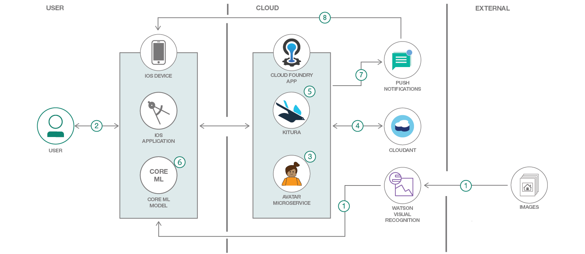
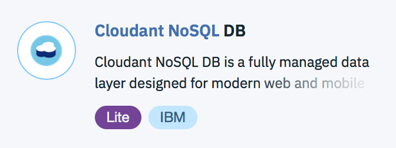
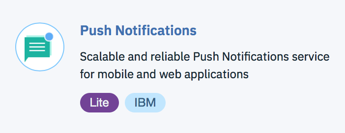
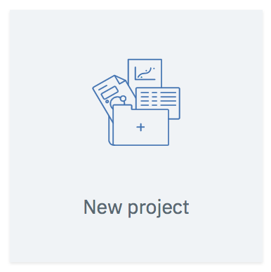
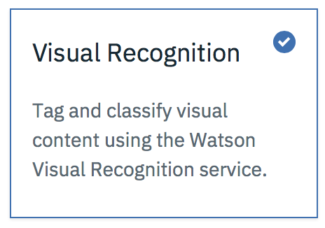
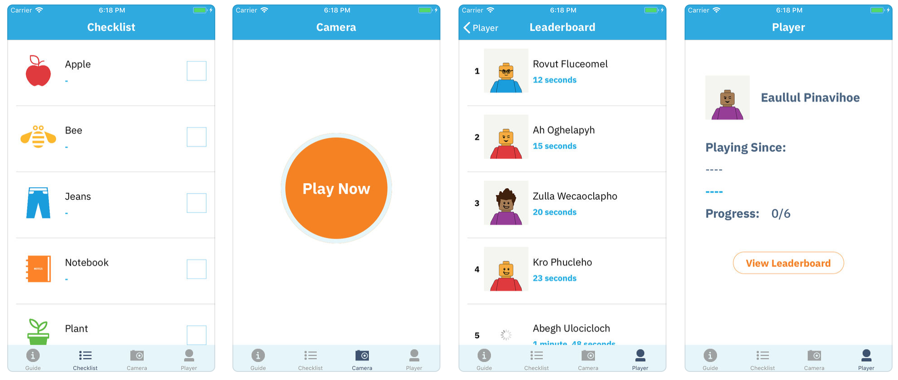

# Build an iOS game powered by Core ML and Watson Visual Recognition

This code pattern is an iOS timed game that has users find items based on a list of objects developed for Apple phones. It is built to showcase visual recognition with Core ML in a fun way. This project repository consists of an iOS app and a backend server. Both components are written in the Swift programming language and leverages the Kitura framework for the server side. Cloudant is also used to persist user records and best times, and Push Notifications are used to let a user know when they have been removed from the top of the leaderboard.

Our application has been published to the App Store under the name [WatsonML](https://itunes.apple.com/us/app/watsonml-visrec-game/id1387609935), and we encourage folks to give it a try. It comes with a built-in model for identifying six objects; shirts, jeans, apples, plants, notebooks, and lastly a plush bee. Our app could not have been built if not for fantastic pre-existing content from other IBMers. We use David Okun's Lumina project, and Anton McConville's Avatar generator microservice, see the references below for more information.

We include instruction on how to modify the application to fit your own needs. Feel free to fork the code and modify it to create your own conference swap game, scavenger hunt, guided tour, or team building or training event.

When the reader has completed this Code Pattern, they will understand how to:

* Create a custom visual recognition model in Watson Studio
* Develop an Swift based iOS application
* Deploy a Kitura based leaderboard
* Detect objects with Core ML and Lumina



## Flow

1. Generate a Core ML model using Watson Visual Recognition and Watson Studio.
2. User runs the iOS application for the first time.
3. The iOS application calls out to the Avatar microservice to generate a random username.
4. The iOS application makes a call to Cloudant to create a user record.
5. The iOS application notifies the Kitura service that the game has started.
6. The user aims the phone's camera as they search for items, using Core ML to identify them.
7. The user receives a push notification if they are bumped from the leaderboard.

## Included components
* [Core ML](https://developer.apple.com/documentation/coreml): Is a framework that will allow integration of machine learning models into apps.
* [Lumina](https://github.com/dokun1/Lumina): Lumina is an open-source Swift framework that allows you to stream video frames through a Core ML model and get instant results.
* [Kitura](https://www.kitura.io/): Kitura is a free and open-source web framework written in Swift, developed by IBM and licensed under Apache 2.0. It’s an HTTP server and web framework for writing Swift server applications.
* [Watson Visual Recognition](https://www.ibm.com/watson/developercloud/visual-recognition.html): Visual Recognition understands the contents of images - visual concepts tag the image, find human faces, approximate age and gender, and find similar images in a collection.

## Featured technologies
* [Artificial Intelligence](https://medium.com/ibm-data-science-experience): Artificial intelligence can be applied to disparate solution spaces to deliver disruptive technologies.
* [Mobile](https://mobilefirstplatform.ibmcloud.com/): Systems of engagement are increasingly using mobile technology as the platform for delivery.

# Prerequisites

The following are prereqs to start developing the application

* Xcode
* IBM Cloud account
* [Carthage](https://github.com/Carthage/Carthage/releases): Download the latest release under `Downloads` select `Carthage.pkg` and install it.

# Steps

### Setting up your iOS app

Clone the project

```
git clone https://github.com/IBM/rainbow/
```

Build the project by navigating to the `iOS` folder on your terminal, and typing:

```
carthage update --platform iOS
```

### Setting Up Your [Kitura](http://kitura.io) Server

1. Go to the [IBM Cloud console](https://console.bluemix.net), and click `Create Resource`.

2. Search for "Cloudant NoSQL DB" and create a service. Take note of the name of the created service. 

  <p align="center">
    
  </p>

3. Go to your Cloudant service home page, and click the green  **Launch** button. Click the database icon on the left, and along the top, click `Create Database`. Name it `routes-users`, and click `Create Document`. Edit your JSON to include a `"username"` and a `"password"` of your choosing. If you do this, you will need this when you set up your iOS application.

4. Do the same thing for a Push Notifications service as well.

  <p align="center">
    
  </p>
 
   > To set up push notifications with your app, you will need to follow the [guide](https://console.bluemix.net/docs/services/mobilepush/index.html#gettingstartedtemplate) for embedding them into your app

5. After cloning this repository, go to `Server/` from the terminal.

6. Run `swift package generate-xcodeproj` which creates the `rainbow-server.xcodeproj` file.

7. In the `config/` directory, find the file `localdev-config.json` that looks like so:

    ```json
    {
        "Cloudant NoSQL DB-kl": {
            "username": "hot",
            "password": "dog",
            "host": "nothotdog",
            "port": 443,
            "url": "hotdog url"
        },
        "rainbow-server-PushNotifications-r6m1": {
            "appGuid": "hotdog guid",
            "url": "hotdo url",
            "admin_url": "hotdog admin url",
            "appSecret": "hotdog",
            "clientSecret": "not hotdog"
        }
    }
    ``` 

    Update the credentials for the Push Notification and Cloudant service in `localdev-config.json`. You will also want to make sure that the names are also correct in `mappings.json`.  

8. Open the project using Xcode by running: `open rainbow-server.xcodeproj`.  

9. You can build and run the project in Xcode, or use the accompanying `runDocker.sh` script to test the app in a Docker container.

### Setting Up Server/Client Credentials

Though the Visual Recognition component of this application does not require API authentication, they are required if you decide to save your high scores to the API. If you created a username and password in your Cloudant database, complete the following steps:

1. Open up the Xcode project for your iOS application.

2. In the `Model` folder, create a file called `WatsonMLClientCredentials.json`.

3. For the `cloudant` node, update the username and password with the service credentials you installed in `localdev-config.json` for your server.

4. For the `routes` node, update the username and password with the service credentials you created in the database in the server set up tutorial. 

From this point forward, you should be able to make valid calls to your Kitura API.

## Build Your Own Model

For this, you should pick a theme and set of items -- museum pieces, office hardware, conference booths, whatever you want! As an example, we'll use fruits, and make a model that can distinguish between 3 fruits: apple, pear, and banana.

1.  Take lots of photos of each of them, and organize each set of at least 10 photos into their own folders. Zip each of them up so you have:   
  a. `Apple.zip`   
  b. `Pear.zip`   
  c. `Banana.zip`   

2. If you have already created an account on [IBM Cloud](https://console.bluemix.net), then go to [Watson Studio](https://dataplatform.ibm.com) and log in with the same credentials.

3. Click the `New Project` button, then click the `Visual Recognition` option, then click `OK`.

<p align="center">
	
	
</p>

4. Pick a project name and a description. If you haven't already created a Cloud Object storage instance, the service should create one for you. Click `Ok`.

5. Look on the right hand side of the screen: you should see a label that says "Upload to project". Select all of the `.zip` folders you previously created and let the folders upload.

6. As the folders upload, drag each of them to the center of the screen, and the classes should be automatically created for you.

7. As a bonus, add as many photos as you can to the "Negative" training class. In this example, try to add as many photos as you can that resemble anything that is not an object you want to recognize. In our example, this could be an orange, grapes, or another fruit. 

8. Click the `Train Model` button. Go get a cup of coffee while you wait for this to finish.

9. When you refresh the page, click the name of the model underneath `Visual Recognition Models`. Click the `Implementation` tab, and then click the `Core ML` option. Download the model that it tells you to download.

10. Replace the model at [iOS/rainbow/Model/ProjectRainbowModel_1753554316.mlmodel](iOS/rainbow/Model/ProjectRainbowModel_1753554316.mlmodel) with the model you just downloaded.

11. Update the JSON file that lists the objects [iOS/rainbow/Config/GameObjects.json](iOS/rainbow/Config/GameObjects.json)

12. If you need icons check out [https://thenounproject.com/](https://thenounproject.com/) - you'll want to find both a colored and white icon for each item!

### Testing The App

You should be able to build and run this app on your device by now. Try to hold the "camera" tab in front of one of the objects, and if it detects the object successfully, you are in the clear!

# Sample output



# Links
* [Lumina](https://github.com/dokun1/Lumina): A camera designed in Swift for easily integrating CoreML models - as well as image streaming, QR/Barcode detection, and many other features.
* [IBM’s Watson Visual Recognition service to support Apple Core ML technology](https://developer.ibm.com/code/2018/03/21/ibm-watson-visual-recognition-service-to-support-apple-core-ml/): Blog from the code pattern author, Steve Martinelli.
* [Deploy a Core ML model with Watson Visual Recognition](https://developer.ibm.com/code/patterns/deploy-a-core-ml-model-with-watson-visual-recognition): code pattern shows you how to create a Core ML model using Watson Visual Recognition, which is then deployed into an iOS application.
* [AI Everywhere with IBM Watson and Apple Core ML](https://www.ibm.com/blogs/watson/2018/03/ai-everywhere-ibm-watson-apple-core-ml/): Blog from the code pattern author, Sridhar Sudarsan.
* [Watson Studio Tooling](https://dataplatform.ibm.com/registration/tepone?target=watson_vision_combined&context=wdp&apps=watson_studio/): Start creating your own Watson Visual Recognition classifier.

# Learn more
* **Artificial Intelligence Code Patterns**: Enjoyed this Code Pattern? Check out our other [AI Code Patterns](https://developer.ibm.com/code/technologies/artificial-intelligence/).
* **AI and Data Code Pattern Playlist**: Bookmark our [playlist](https://www.youtube.com/playlist?list=PLzUbsvIyrNfknNewObx5N7uGZ5FKH0Fde) with all of our Code Pattern videos

# License
This code pattern is licensed under the Apache Software License, Version 2.  Separate third party code objects invoked within this code pattern are licensed by their respective providers pursuant to their own separate licenses. Contributions are subject to the [Developer Certificate of Origin, Version 1.1 (DCO)](https://developercertificate.org/) and the [Apache Software License, Version 2](http://www.apache.org/licenses/LICENSE-2.0.txt).

[Apache Software License (ASL) FAQ](http://www.apache.org/foundation/license-faq.html#WhatDoesItMEAN)
